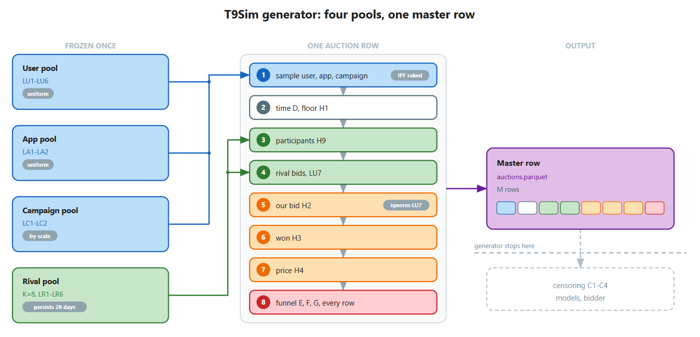
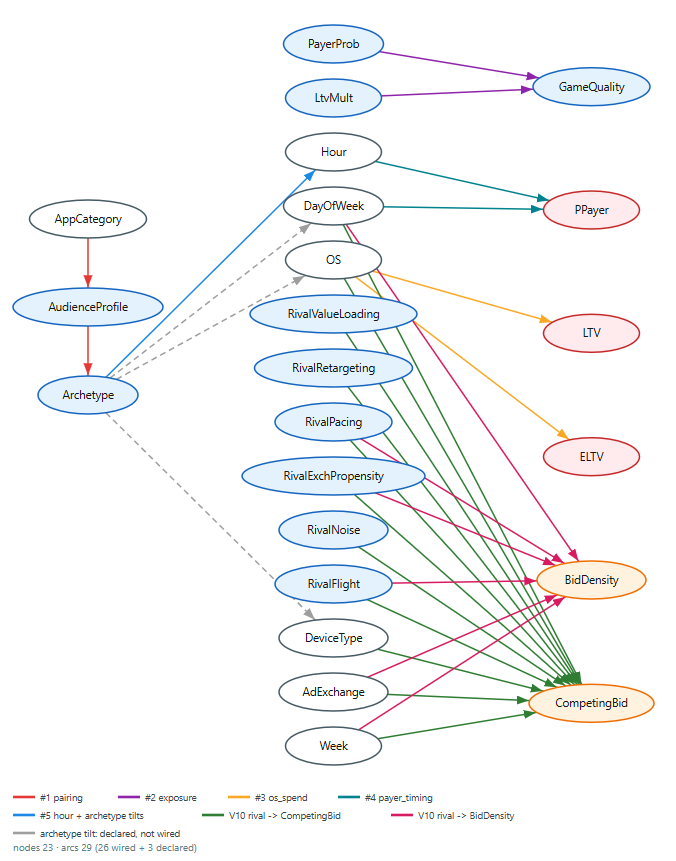

# T9Sim Specification (v10)

T9 is a synthetic-data generator for mobile in-app advertising auctions: one DSP bids for impressions against a generated market of eight persistent rival-bidder archetypes in a 2025 US mobile-gaming market.

**Ground truth and views.** One master table carries complete ground truth (funnel outcomes click / install / payer / spend on every row, lost auctions included, as a declared counterfactual); four censored views C1-C4 reproduce what a DSP would see with and without an MMP (cross-network funnel attribution) and an SSP (loss prices and competition density).

**Downstream models.** Tier 1 = four funnel heads (P(click), P(install|click), P(payer|install), E[spend|payer]); Tier 2 = P(win|bid). Competing pressure is a generated rival market, the Rival-Pool Layer.

**How to read this document.** Every variable and edge fact is defined in exactly one place; all other mentions are cross-references to it.

- **Part I (The Data)** defines what exists as data: variable existence, domains, parent sets, observability, censoring, and the parquet mapping. The master variable table (section 1.6) is the one truth table, replacing the separate tables of the source documents.
- **Part II (The Generator)** defines the mathematical form (the conditional laws, with their clips) and the wiring status (the edge inventory, section 2.6).
- **Part III (Identification)** carries propositions P1-P4 verbatim.
- **Part IV (Status)** covers build status, tunables, validation targets, and the version trail.
- **Appendix A** logs every resolved mismatch between the sources, so the merge is auditable.

Arbiter rules used throughout:

- CODE decides what exists and what is wired (`rival_pool.py`, `auctions.py`, `make_cpts.py`, `user_profiles.py`, `catalogue.py`, `config/*.yaml`);
- the schema decides observability and censoring semantics;
- the formalisation decides mathematical form;
- `docs/T9Sim_Implementation_Status.md` and `docs/Known_Defects_Register.md` record wiring status, and this document agrees with both except where Appendix A says why a register row should be amended.

---

# Part I - The Data

## 1.1 What the generator emits

- One master parquet (`auctions.parquet`; 55 columns in the headline configuration, where edge #1 materialises the five `la2_*` columns and group #6 adds `bid_density`; per-row availability in 1.5).
- Four censored views C1-C4 derived from it. The master carries every column on every row: A, B, C, D families (observables), E, F, G, H families (outcome labels; H1 floor and H2 own bid are observed inputs), plus pool variables (latents) and estimands.

## 1.2 Market setting

**Market and calibration.** Tier-1 US mobile-gaming market, calibrated to US 2025 benchmarks, priced in USD. iPinYou (2013, China) supplies empirical distribution *shapes* for a subset of features; price *levels* are rescaled to 2025 US mobile eCPM. Region/city codes are anonymised integers with a canonical city → region hierarchy (no real names).

**Inventory and genre.** Every auction is mobile in-app inventory in a gaming app (publisher = a game). One genre taxonomy `G = [casual, strategy, rpg, hypercasual]` spans user interest, host-app category and advertised genre (real UA also runs on non-gaming inventory; a declared simplification).

**Competition.** Not gaming-only: it is modelled structurally as 3 gaming + 5 non-gaming rival archetypes (section 2.5).

**Auction format.** All auctions are **first-price** (2025 mobile in-app mediation: AppLovin MAX, Unity LevelPlay, AdMob). iPinYou's second-price `paying_price` is reused as the clearing-price shape (revenue equivalence); bid-shading dynamics are abstracted away.

**Attribution and user history.** Single-touch, with no cross-auction user history: a user's latents (LU1-LU6) and Section-A features are shared across all that user's auctions; only per-auction quantities vary.

## 1.3 Naming note

Plain C1-C4 always means the experimental conditions (C1 = DSP, C2 = DSP+MMP, C3 = DSP+SSP, C4 = all), never the campaign columns `C1`-`C4`. Extensions (Appendix M9): the labels E1-E5 in the rival-market material (sections 2.5 and 2.6) name graph edges, never the click columns `E1`/`E2`. The fourth Tier-1 head is written E[spend|payer] and E[ltv|payer] interchangeably: one estimand, two conventional names (spend = LTV = G2).

## 1.4 Observability statuses

Every column has exactly one **primary** status. The test for *latent* is a single question: does the variable ever appear in the data the learner sees? It is not whether the generator knows its value (the generator knows everything).

| Status | Columns / variables | Meaning |
|---|---|---|
| **Latent (ground-truth) parameters** | LU1-LU6, LA1-LA2, LC1-LC2, LR1-LR6 | Generative parameters: they shape the draws but are never columns in any view, and no model infers them. LU/LA/LC are master columns (dropped from views); LR1-LR6 are generator-internal (1.7). |
| **Latent auction variable** | LU7 `competing_bid` | A hidden per-auction draw (not a pool parameter), never a column in any view. On lost-but-sold rows in C3/C4 it leaks through `H4 = LU7`: that leak **is** the SSP signal. `LU7 = max` over rival bids (2.5). |
| **Observed features** | A1-A5, B1-B6, `C1`-`C4`, D1-D3, H1 (floor), H2 (own bid) | Visible columns; model inputs in every condition. |
| **Outcome labels** | E1-E2, F1-F2, G1-G4, H3, H4, H9 | Random draws on **all** master rows, observed or censored per condition and row (1.5): H3 everywhere; E/F/G on won rows (C1/C3) or all rows (C2/C4); H4, H9 in C3/C4 only. |
| **Estimands (latent ground-truth quantities)** | P(click), P(install\|click), P(payer\|install), E[ltv\|payer], EV; P(win\|bid) for Tier 2 | The deterministic quantities computed *before* each draw; the labels are their noisy realisations. Tier-1 estimates the funnel quantities, Tier-2 estimates P(win\|bid), from visible features. |

Censoring is not latent status: it withholds an *observable* label from specific conditions and rows, and the C1-C4 comparison rests entirely on it. Admissibility follows: the five estimands, `lu7_competing_bid` and `la2_audience_shares` are never model features in any condition (nor in the oracle-features diagnostic).

## 1.5 Censoring map: the C1-C4 views

One master table; four views. Identical rows and temporal split in every condition (split days 1-20 / 21-24 / 25-28 BEFORE censoring); only label visibility differs. Views are masks, never copies.

| Condition | Layers | E/F/G (click, install, payer, LTV) | H4 clearing | H9 rival count | Always visible |
|---|---|---|---|---|---|
| **C1** | DSP only | **won rows only** (standard postbacks) | hidden | hidden | A, B, `C`, D, H1, H2, H3 |
| **C2** | DSP + MMP | **all rows** (cross-network attribution) | hidden | hidden | A, B, `C`, D, H1, H2, H3 |
| **C3** | DSP + SSP | **won rows only** | **all rows** (NaN only where unsold) | **all rows** | A, B, `C`, D, H1, H2, H3 |
| **C4** | DSP + MMP + SSP | **all rows** | **all rows** | **all rows** | A, B, `C`, D, H1, H2, H3 |

`user_id` is master-lineage only (dropped from every view; user/device ids carry no signal under single-touch).

**NaN semantics.** Censored cells are **NaN** in the view, distinct from `-1` (an *observed* no-event timestamp on E2/F2) and from `0` labels; this applies to all of E1-E2, F1-F2, G1-G4 on masked rows. "Hidden" H4/H9 in C1/C2 are all-NaN columns (kept, not dropped, so all views share one column schema).

**Real-world mapping (MMP).** Every DSP gets won-row postbacks (C1/C3). What MMP adds is attribution on the auctions the DSP *lost*: its tracking links and in-game SDK record clicks, installs and spend whoever won (C2/C4). Those lost rows are systematically the high-value impressions (the DSP's biased view).

**Real-world mapping (SSP).** An SSP sees every auction it runs: clearing prices on losses (H4) and realized competition density (H9) are exactly what SSP ownership reveals and a lone DSP cannot observe.

**Counterfactual simplification (declared).** Lost-row E/F/G represent what the attribution chain would have recorded had our ad been served; the competitor's creative is not modelled. The outcome formulas never depend on `won`, so this counterfactual is well-defined within the model.

**What each lift measures.**

- **C1→C2**: value of cross-network attribution. Same rows, unbiased funnel labels; corrects the DSP's biased view (selection bias).
- **C1→C3**: value of price visibility. Lost-row clearing prices and competition density fingerprint hidden rival structure; Tier-2 win-curve precision.
- **C2→C4**: marginal SSP on top of full attribution.
- **C3→C4**: marginal MMP on top of price visibility.

None of the dependency edges confounds the C1-C4 comparison: #1-#5 are marginal-preserving and act identically across views, and the rival pool touches the views only through H9 (SSP-only) and H4's lost-row values.

**Per-row availability (master table).** Every row carries every column: A, B, C, D, E, F, G, H + latents + estimands. The master is never NaN-censored: the only NaN is H4 on unsold rows (no clearing price exists); E2/F2 use -1 for "no event". All won/lost-conditional hiding happens in the condition views (this section), never in generation.

## 1.6 The master variable table

The one truth table: every variable of the generative model, with kind, domain, parent set, generating-rule reference, censoring, and parquet column(s). Mathematical laws live in sections 2.4-2.5; wiring status in 2.6.

Censoring legend (schema authority): **always** = visible in all four views C1-C4. **funnel** = won rows only in C1/C3, all rows in C2/C4 (masked cells NaN; -1 is an observed no-event timestamp, distinct from NaN). **ssp** = hidden in C1/C2 (all-NaN column, kept so all views share one column schema), all rows in C3/C4. **master** = master-parquet column only, dropped from every view. **none** = never materialised as a column anywhere. Conditions C1-C4 per the naming note (1.3).

| Code | Name | Kind | Domain | Parent set | Generating rule ref |
|---|---|---|---|---|---|
| A1 | region | observed | finite int codes, anonymised |  | user_profiles.py:36 |
| A2 | city | observed | finite int codes nested in region | A1 | user_profiles.py:41 |
| A3 | os | observed | {iOS, Android}; 0.55/0.45, 0.59/0.41 with #3 ON |  | user_profiles.py:50 |
| A4 | os_version | observed | finite label set per OS | A3 | user_profiles.py:57 |
| A5 | device_type | observed | {phone, tablet} 0.90/0.10 |  | user_profiles.py:51 |
| B1 | app_id | observed | app pool ids | app_i; #1 ON: LU1, LA2 (via pair_idx) | auctions.py:279-293 |
| B2 | app_category | observed | G = {casual, strategy, rpg, hypercasual}; quota 0.50/0.20/0.20/0.10 | B1 | catalogue.py:34 |
| B3 | ad_exchange | observed | finite exchange set |  | auctions.py:316 |
| B4 | slot_width | observed | positive int | _size | auctions.py:327 |
| B5 | slot_height | observed | positive int | _size | auctions.py:327 |
| B6 | slot_format | observed | {1 banner, 2 interstitial, 3 rewarded} |  | auctions.py:318 |
| C1 | advertiser_id | observed | pool ids | C3 | catalogue.py build_campaigns |
| C2 | advertiser_scale | observed | {indie, mid, major}; advertiser shares 0.85/0.13/0.02 | C1 | catalogue.py:95 |
| C3 | campaign_id | observed | campaign pool ids | c_idx; #2 ON: LU4, LU5, LC2 | auctions.py:295-303 |
| C4 | ad_genre | observed | G; mix 0.55/0.17/0.20/0.08 | C3 | catalogue.py:129 |
| D1 | timestamp | observed | Unix s; 28-day window from 2025-06-02 | D2, D3, D4 | auctions.py:345-347 |
| D2 | hour_of_day | observed | {0..23} | #5 ON: LU1; OFF: joint with D3 (M11) | auctions.py:331-343 |
| D3 | day_of_week | observed | {0 Mon .. 6 Sun} | OFF: joint with D2 (M18) | auctions.py:332, 341-343 |
| D4 | week | internal | {0..3} uniform |  | auctions.py:344 |
| H1 | floor_price | observed | [0, inf) USD eCPM; zero floors stay zero | B6 | auctions.py:426 |
| H2 | bid_price | observed | (0, inf) USD eCPM | v_slot, ease, B2, C2; NO LU7 input | auctions.py:516-530 |
| E1 | click | outcome | {0,1} ~ Bern(p_click) | p_click | auctions.py:556 |
| E2 | click_timestamp | outcome | Unix s, or -1 = observed no-click | E1, D1 | auctions.py:569 |
| F1 | install | outcome | {0,1}; 0 without click | E1, p_install | auctions.py:557 |
| F2 | install_timestamp | outcome | Unix s, or -1 | F1, E2 | auctions.py:571 |
| G1 | is_payer | outcome | {0,1}; 0 without install | F1, p_payer | auctions.py:558 |
| G2 | ltv_value | outcome | [0, inf) USD = LogNormal(mu_cat, 1.648169) x LU5 x LC2 x plat; 0 for non-payers | G1, mu_cat, LU5, LC2, plat (#3) | auctions.py:561 |
| G3 | ltv_7d | outcome | [0, inf) = 0.40 x G2 | G2 | auctions.py:581 |
| G4 | ltv_30d | outcome | [0, inf) = 0.70 x G2 | G2 | auctions.py:582 |
| H3 | won | outcome | {0,1} = 1[H2 >= max(LU7, H1)] | H2, LU7, H1 | auctions.py:542-544 |
| H4 | clearing_price | outcome / observed | (0, inf) USD eCPM; first-price: H2 if won, LU7 if sold_lost, NaN if unsold | H3, H2, sold_lost, LU7 | auctions.py:545-548 |
| H9 | bid_density | outcome / observed | {1..8} | Z_k | rival_pool.py:120 |
| LU1 | lu1_archetype | latent | {whale, engaged_spender, casual, time_filler, inactive}; pi = 0.02/0.08/0.20/0.40/0.30 |  | user_profiles.py:52,59 |
| LU2 | lu2_click_prop | latent | (0,1); Beta per archetype | LU1 | user_profiles.py:74 |
| LU3 | lu3_install_prop | latent | (0,1); Beta per archetype | LU1 | user_profiles.py:75 |
| LU4 | lu4_payer_prob | latent | [0,1); Beta per archetype; 0 for inactive (M19) | LU1 | user_profiles.py:76,79-84 |
| LU5 | lu5_ltv_mult | latent | [0, inf); LogNormal per archetype; 0 for inactive | LU1 | user_profiles.py:78-85 |
| LU6 | interest vector | latent | 4-simplex over G; Dirichlet(20 x centroid[LU1]) | LU1 | user_profiles.py:87 |
| LU7 | lu7_competing_bid | latent | (0, inf) USD eCPM | Z_k, base_e, z, LR1, LR2, LR3, LR5 (law in 2.5) | rival_pool.py:106-119 |
| LA1 | la1_app_quality | latent | (0, inf); LogNormal(0, 0.30) |  | catalogue.py:44 |
| LA2 | app audience profile | latent | 5-simplex over archetypes; Dirichlet(3.0 x centroid[B2]); #1 ON only | B2 | catalogue.py:65 |
| LC1 | lc1_creative_appeal | latent | (0, inf); LogNormal(0, 0.25) |  | catalogue.py:130 |
| LC2 | lc2_game_quality | latent | (0, inf); LogNormal(0, 0.35) |  | catalogue.py:131 |
| LR1 | value loading | latent | U(0.35, 0.75) gaming; U(0.00, 0.20) non-gaming |  | rival_pool.py:52-54 |
| LR2 | retargeting matrix | latent | iid N(0,1) per (segment, rival); scaled by beta_R = 0.5 |  | rival_pool.py:44-49,57 |
| LR3 | pacing state | latent | real; AR(1), phi_p = 0.85, sigma_p = 0.30 |  | rival_pool.py:67-73 |
| LR4 | exchange participation | latent | U(0.15, 0.60); k=0 forced 1.0 |  | rival_pool.py:63-64 |
| LR5 | log-bid dispersion | latent | U(0.30, 0.55) |  | rival_pool.py:60 |
| LR6 | flight mask | latent | {0,1}; k >= 1: prob 0.5 one dark block of 2-5 days; k=0 never dark |  | rival_pool.py:76-82 |
| - | p_click | estimand | [0,1] = clip(base_ctr x LU2 x v_slot x m_click x LA1 x LC1); base_ctr = 0.27141 | LU2, v_slot, m_stage, LA1, LC1 | auctions.py:370 |
| - | p_install | estimand | [0,1] = clip(base_ir x LU3 x ease x m_install x LA1); base_ir = 2.564963 | LU3, ease, m_stage, LA1 | auctions.py:373 |
| - | p_payer | estimand | [0,1] = clip(base_payer x LU4 x m_pay); #4 ON: x t_pay, re-clipped (M6); base_payer = 0.257853 | LU4, m_stage, t_pay (#4) | auctions.py:376-384 |
| - | e_ltv | estimand | [0, inf) = exp(mu_cat + sigma^2/2) x LU5 x LC2 x plat; sigma = 1.648169 | mu_cat, LU5, LC2, plat (#3) | auctions.py:387-394 |
| - | ev_truth | estimand | [0, inf) = p_click x p_install x p_payer x e_ltv | p_click, p_install, p_payer, e_ltv | auctions.py:395 |
| - | user_id | internal | user pool index |  | user pool |
| - | _size | internal | finite width x height label per format | B6 | auctions.py:325 |
| - | app_i | internal | app pool position | pair_idx (#1 ON); uniform (OFF) | auctions.py:282 |
| - | u_rows | internal | user pool position | pair_idx (#1 ON); uniform (OFF) | auctions.py:288 |
| - | pair_idx | internal | (archetype x app) cell of the IPF joint | LU1, LA2 | auctions.py:281 |
| - | user_vbin | internal | value bins of g = z(log(LU4 x LU5)); qcut, ties at 0 collapse bins | u_rows, LU4, LU5 | auctions.py:296 |
| - | c_idx | internal | campaign pool position | #2 ON: user_vbin, LC2, sample_weight; OFF: sample_weight | auctions.py:302 |
| - | sample_weight | internal | (0,1), sums to 1 over campaigns | C2 | catalogue.py:148-150 |
| - | r_genre | internal | (0,1] = LU6[C4] | LU6, C4 | auctions.py:361 |
| - | m_stage | internal | m_s = (1 - w_s) + w_s x r; w = (0.5, 0.6, 0.7) | r_genre | auctions.py:362 |
| - | v_slot | internal | approx [0.45, 2]; format weight x size weight | B6, _size | auctions.py:363-364 |
| - | ease | internal | (0, inf); install-ease per app category | B2 | auctions.py:366 |
| - | mu_cat | internal | real = 0.481154 + ln(ltv tier(B2)); #3 ON: minus ln E[plat] | B2 (#3 recentre) | auctions.py:367,387-391 |
| - | plat | internal | #3 ON: 1.8 iOS, 1.0 Android; else 1 | A3 (#3) | auctions.py:388 |
| - | t_pay | internal | (0, inf); hour x dow multiplier, raked to mean 1 (#4) | D2, D3 | auctions.py:383 |
| - | base_e | internal | (0, inf) = max(pay_shape x ecpm_target(B6), 0.01 x target) (M6) | B6 | auctions.py:429-430 |
| - | z | internal | real = (log ev_truth - z_mu)/z_sigma on ev > 0, else 0 | ev_truth | auctions.py:432-436 |
| - | Z_k | internal | {0,1} ~ Bern(min(1, LR4 x LR6 x gate(LR3))); Z_0 forced 1 | LR4, LR6, LR3, B3, day index | rival_pool.py:106-112 |
| - | sold_lost | internal | {0,1} = (1 - H3) x 1[LU7 >= H1] | H3, LU7, H1 | auctions.py:543 |

**Column mapping.** Each variable is one parquet column named as in the Name column, except: LU6 is stored as four columns `lu6_casual`, `lu6_strategy`, `lu6_rpg`, `lu6_hypercasual`; LA2 as five columns `la2_<archetype>` (materialised only when #1 is on). Rows whose censoring cell reads `none` are generator-internal and never become columns.

## 1.7 Map-to-parquet reconciliation

Schema map = the `Schema V10a/b/c` trio in `Schema diagrams/`.

| | Count |
|---|---|
| Variable boxes in the map | 41 = 36 single + 5 compound (`E1/E2`, `F1/F2`, `G2/G3/G4`, `B4/B5`, `C1/C3`) |
| Schema variables | 47 = 36 + 11 in the compound boxes |
| Columns from variables | 54 (LU6 stored as 4 genre columns, LA2 as 5 archetype columns, rest 1:1) |
| + `user_id` (row lineage, not a schema variable) | **55 = master parquet columns** |
| Non-column boxes | 2: the LATENTS header and the dashed rival box (LR1-LR6, `b_ik`: generator-internal, never columns) |

**Three counts, never interchanged.** **55 parquet columns** (the physical fields in `auctions.parquet`); **47 schema variables** (the coded A-H and LU/LA/LC/LR entries, i.e. the map's 41 boxes; fewer than columns because LU6 expands to 4 columns and LA2 to 5, and `user_id` is a column but not a variable); **72 generator quantities** (every master-table row bar `user_id`, including the deterministic internals like `z`, `mu_cat`, `base_e` that never become columns but that the dependency graph routes through).

Verified master parquet column list (22 Jul, headline configuration with #1 and #6 on, 55 columns): user_id, region, city, os, os_version, device_type, lu1_archetype, lu2_click_prop, lu3_install_prop, lu4_payer_prob, lu5_ltv_mult, lu6_{casual,strategy,rpg,hypercasual}, app_id, app_category, la1_app_quality, la2_{whale,engaged_spender,casual,time_filler,inactive}, campaign_id, advertiser_id, advertiser_scale, ad_genre, lc1_creative_appeal, lc2_game_quality, ad_exchange, slot_format, slot_width, slot_height, timestamp, hour_of_day, day_of_week, p_click, p_install, p_payer, e_ltv, ev_truth, floor_price, lu7_competing_bid, bid_price, won, clearing_price, click, click_timestamp, install, install_timestamp, is_payer, ltv_value, ltv_7d, ltv_30d, bid_density.

## 1.8 Per-family notes

- **A (user).** Root features of the user pool: region/city from iPinYou, os/os_version/device_type from StatCounter US; A4 nested on A3. The archetype tilts on A3/A5 are declared but unwired (2.6).
- **B (app context).** B1-B2 from the app pool, B3-B6 per-auction. B4/B5 are an IAB size pair conditional on format (via `_size`); category quota from Sensor Tower and Newzoo; exchange shares from US 2025 mediation.
- **C (campaign).** Advertiser ids anchored to iPinYou `advertiser_id`. Pool chain C3 -> C1 -> C2 (a campaign belongs to an advertiser with a scale tier); C4 is a campaign property. Frequency follows `advertiser_scale` via `sample_weight`.
- **D (time).** D2 and D3 drawn first; D1 assembled from them plus the week D4 (generator-internal). Time-structure scoping in 2.6 (edge #5).
- **E/F/G (funnel).** Generated on all rows (lost rows = the counterfactual, 1.5); the chain gates deterministically (no click -> no install -> no payer -> zero spend). Timestamps use -1 for no-event.
- **H (market).** H5-H8 unused (the master jumps H4 to H9). H4 and H9 are SSP-exclusive: H3 (win/loss) is visible in all conditions; C3/C4 add the loss price (H4 = LU7) and competition density (H9 = N, 1-8 per auction).
- **LU/LA/LC (pool latents).** Withheld as columns. User latents are effectively unrecoverable (each user appears in only ~tens of rows); app and campaign latents are partly recoverable from `app_id`/`campaign_id` (constant across an entity's rows), which is realistic and does not confound the DSP/MMP/SSP comparison since those ids are visible in all of C1-C4.
- **LR (rival latents).** The complete family LR1-LR6, and the footprint rule that governs its observability, are specified in section 2.5.
- **Estimands.** The Tier-1 models estimate `p_click`, `p_install`, `p_payer`, `E[spend|payer]` from visible features, and the bidder reconstructs an EV estimate by multiplying them. Tier-2 estimand: P(win|bid).

---

# Part II - The Generator

## 2.1 Scope, pools, and generation order

**Pools.** T9Sim is a structured generative model over a single ad auction. Four fixed pools supply its entities: a user pool (`user_profiles.py`), an app pool and a campaign pool (`catalogue.py`), and a rival pool of K = 8 persistent rival-bidder archetypes (latents LR1-LR6, frozen at creation; `rival_pool.py:31-82`). One auction row draws a (user, app, campaign, context) tuple, runs the conversion funnel, and settles the market against the rival pool.

*Figure 2.1. The generator at a glance: four pools (frozen once) feed the ten-step per-auction sequence, whose output is one uncensored master row; the dashed rule marks where the generator stops. Source: `Schema diagrams/T9Sim_Generator.svg`.*

**In and out of scope of the generator:**

- IN scope: the generative law producing the full uncensored master record (`auctions.parquet`), up to and including `AuctionEngine.chunk`.
- OUT of scope: censoring into C1-C4 (`censor.py`, run after generation; semantics in 1.5), the learned models, and the bidder.

**Four pools.**

1. **User pool** (N users): latents LU1-LU6 + Section-A features. A-features calibrated from **deduplicated** iPinYou users (user-population shape, not bid-weighted).
2. **App pool** (apps): visible `app_id` + `app_category`, plus latent `app_quality`, `app_audience_profile`.
3. **Campaign pool** (campaigns): visible `campaign_id` → `advertiser_id` → `advertiser_scale`, `ad_genre`, plus latent `creative_appeal`, `game_quality`.
4. **Rival pool**: K = 8 persistent rival-bidder archetypes, coded as 3 gaming + 5 non-gaming, each with latent private LTV-model loadings, retargeting matrix, budget-pacing state, exchange-participation profile, idiosyncratic dispersion and flight mask (LR1-LR6). Frozen at creation like the other pools; sampled per auction via participation draws.

**Auctions** (M rows): each samples one user + one app + one campaign, then draws Time (D), computes the true head means, and draws the rival-pool competing bid, bid/price labels (H) and funnel outcomes (E, F, G) on **every** row. Per-auction order:

1. Sample (user, app, campaign).
2. Draw D: D2 hour and D3 day-of-week first, then the D1 timestamp assembled from them plus the week.
3. Compute the four head means: p_click, p_install, p_payer, e_ltv. Their product is ev_truth; its z-score is z.
4. Draw H1 floor.
5. Participation draws Z_ik, giving the participant set A_i and the count N_i = H9.
6. Rival bids b_ik, giving LU7 = max.
7. Our bid H2, which takes no input from LU7 (H2 and LU7 remain correlated through the shared latents).
8. H3 = 1{H2 >= max(LU7, H1)}.
9. H4 per the clearing rule.
10. Funnel draws E, F, G on every row.

**Pool semantics.** Pools are built once. Each auction row picks an existing user, app and campaign rather than inventing new ones, so the same entity recurs across many rows carrying the latents it was created with. That repetition is what makes entity features learnable: `app_id` always arrives with the same hidden quality `LA1`. Only the context is redrawn per row: exchange, slot and time.

**Sampling weights.** Every user and every app is equally likely to be picked for an auction: no user is busier than another, and no app is more popular. Both refinements are deferred. Campaigns are the exception, with bigger advertisers bidding more often, following `advertiser_scale`.

**Rival persistence.** Rival archetypes persist across the whole 28-day window: retargeting rates are persistent, pacing follows a day-level AR(1) process, and flight schedules switch campaigns on and off. That persistence is exactly what makes their footprints statistically recoverable from rolling SSP aggregates (footprint rule, 2.5).

*Scoping note (Appendix M10): "drawn uniformly" is a statement about marginals; with edge #1 ON the IPF pairing tilts the (archetype x app) joint while preserving both marginals (uniform app popularity as column sums).*

## 2.2 Joint factorisation

Section 2.1 gave the generator as a procedure: a list of steps in an order. This section gives the *same* generator as a single probability, $p(\text{master})$, the chance of producing one entire dataset: all four pools plus all $M$ auction rows. The quantity itself is never computed; it is written down for its **structure**, not its value, because that structure is what states exactly what depends on what, and it is what the censoring and identification results in Part III are read from.

The dataset is built in two stages, and the formula has one part for each. First the four **pools** are drawn: users, apps, campaigns, and a rival pool of $K_{\mathrm{riv}}=8$ rivals, each entity drawn once and independently. ($\theta^U_u$ is the whole latent bundle of user $u$, and likewise $\theta^A_a,\theta^C_c,\theta^K_k$.) Then each auction row $i$ is drawn, conditional on those pools.

$$
p(\text{master})=\underbrace{\prod_{u}p(\theta^U_u)\prod_{a}p(\theta^A_a)\prod_{c}p(\theta^C_c)\prod_{k}p(\theta^K_k)}_{p(\text{pools})}\;\times\;\prod_{i}\Big[\underbrace{\prod_{j}p\!\left(x_{ij}\mid \mathrm{pa}(x_{ij})\right)}_{\text{pairing + context }x_i}\cdot\;p(\text{funnel}_i\mid x_i,\theta_i)\cdot\;p(\text{market}_i\mid z_i,x_i,\theta_i,\theta^K_{1:K})\Big]
$$

**Reading the formula against the procedure.** Each factor is one part of the 2.1 procedure; the table below is the key. Reminder on the symbols: $\prod_u,\prod_a,\dots$ multiply the term over every user, app, and so on; $p(x\mid \mathrm{pa}(x))$ is the draw of $x$ given its *parents* $\mathrm{pa}(x)$, the variables it directly depends on.

| Factor | Procedure step | In words |
|---|---|---|
| $\prod_u p(\theta^U_u)\prod_a p(\theta^A_a)\prod_c p(\theta^C_c)\prod_k p(\theta^K_k)$ | before step 1 | The four pools, each entity drawn once and independently, before any auction. This is $p(\text{pools})$. |
| outer $\prod_i[\dots]$ | "on every row" | One bracket per auction row $i$; rows are independent **given** the pools. |
| $\prod_j p(x_{ij}\mid \mathrm{pa}(x_{ij}))$ | 1-2 | Select the (user, app, campaign) triple and draw the context (time, slot, exchange) for row $i$. |
| $p(\text{funnel}_i\mid x_i,\theta_i)$ | 3, 10 | The true head means and the realised click/install/payer/spend outcomes. |
| $p(\text{market}_i\mid z_i,x_i,\theta_i,\theta^K_{1:K})$ | 4-9 | Floor, rival participation and bids, our bid, win and clearing. |

The two say the same thing with one difference: the procedure fixes dependency by *order* ("D2 and D3 first, then D1"), the formula by *parents* $\mathrm{pa}(x)$ — and only the parents form is order-free, so it states the structure directly.

*Notation.* $\theta_i=(\theta^U_{u(i)},\theta^A_{a(i)},\theta^C_{c(i)})$ is the latent bundle of the user, app and campaign row $i$ drew (indices `u_rows`, `app_i`, `c_idx`). Full parent sets are defined in the master table (1.6).

*Acyclicity.* $z_i=(\log \mathrm{ev\_truth}_i - z_\mu)/z_\sigma$ is computed in the funnel/oracle block and read only by the market (`auctions.py:434-436`), never fed back, so each row is acyclic and the product is a valid joint distribution.

## 2.3 The dependency graph

**What this section is for.** This section is about which variables depend on which. Six modelled dependencies (#1-#6) connect some of the generator's variables to others; those connected variables are the **dependency graph**, drawn as the 23 nodes listed below. The rest take no part in the six: they are independent draws (region, city, slot geometry, floor), deterministic equations (stage multipliers, settlement rules), or variables whose parents are fixed base structure rather than one of the six (`p_click`, `ev_truth`).

*Figure 2.3. The dependency graph: the 23 variables the six dependencies connect. Dashed grey = declared but not yet wired (2.6-2.7). Source: `Schema diagrams/T9Sim_DepGraph_anchored.svg`.*

**The six dependencies**, one line each; the laws are in 2.4-2.5, the wiring in 2.6.

| # | Name | What it creates | Code |
|---|---|---|---|
| #1 | `pairing` | users are paired to apps by archetype, so `app_id` signals the user's type | `catalogue.py:65`, `auctions.py:281-288` |
| #2 | `exposure` | higher-value users draw higher-quality campaigns | `auctions.py:296-303` |
| #3 | `os_spend` | iOS lifts spend: `plat` enters `e_ltv` and `ltv_value` | `auctions.py:388-393, 561` |
| #4 | `payer_timing` | hour and day scale the payer rate (2.7) | `auctions.py:383` |
| #5 | `hour` | archetype shifts the hour of day (three more tilts declared but unwired, 2.6) | `auctions.py:332-339` |
| #6 | `rival_pool` | eight rivals set `lu7_competing_bid` (their max bid) and `bid_density` (their count) | `rival_pool.py:31-120` |

**The 23 variables they connect.** Each is listed once, under its main dependency, with "(also #n)" for a second. Dependency #5 contributes no variable of its own: all five of its endpoints appear elsewhere in the table.

| Node | Schema code | Dependency | Figure label |
|---|---|---|---|
| app_category | B2 | #1 pairing | AppCategory |
| audience_shares | LA2 | #1 pairing | AudienceProfile |
| archetype | LU1 | #1 pairing (also #5) | Archetype |
| payer_prob | LU4 | #2 exposure | PayerProb |
| ltv_mult | LU5 | #2 exposure | LtvMult |
| game_quality | LC2 | #2 exposure | GameQuality |
| os | A3 | #3 os_spend (also #5, #6) | OS |
| e_ltv | e_ltv | #3 os_spend | ELTV |
| ltv_value | G2 | #3 os_spend | LTV |
| hour_of_day | D2 | #4 payer_timing (also #5) | Hour |
| day_of_week | D3 | #4 payer_timing (also #5, #6) | DayOfWeek |
| p_payer | p_payer | #4 payer_timing | PPayer |
| w_k | LR1 | #6 rival_pool | RivalValueLoading |
| R | LR2 | #6 rival_pool | RivalRetargeting |
| pace | LR3 | #6 rival_pool | RivalPacing |
| pi_ke | LR4 | #6 rival_pool | RivalExchPropensity |
| sigma_k | LR5 | #6 rival_pool | RivalNoise |
| flight | LR6 | #6 rival_pool | RivalFlight |
| ad_exchange | B3 | #6 rival_pool | AdExchange |
| device_type | A5 | #6 rival_pool (also #5) | DeviceType |
| week | D4 | #6 rival_pool | Week |
| lu7_competing_bid | LU7 | #6 rival_pool | CompetingBid |
| bid_density | H9 | #6 rival_pool | BidDensity |

**Also in the code, off here.** Three of dependency #5's declared tilts (on `os`, `device_type`, `day_of_week`) are not yet wired, and five further price dependencies are switched off in this paper's configuration; both are detailed in 2.6-2.7.

## 2.4 Conditional laws (code-faithful, with clips)

Every law below is code-faithful to the paper configuration. Calibrated constants (shares, Beta/LogNormal/sigma parameters, base rates, eCPM targets, floor/pay shapes, decay) live in `config/*.yaml` (`archetypes.yaml`, `benchmarks.yaml`, `bn_cpts.yaml`, merged with `calibrated.yaml`); the load-bearing calibrated values are printed in the master table (1.6). The rival-pool laws are in 2.5.

| Code | Name | Formula | Code location | Note |
|---|---|---|---|---|
| **Latents** | | | | |
| LU1 | archetype | `κ ~ Cat(π)` | `user_profiles.py:52` | shares in `archetypes.yaml` |
| LU2 | click propensity | `q^clk ~ Beta(a,b \| κ)` | `:74` | |
| LU3 | install propensity | `q^ins ~ Beta(a,b \| κ)` | `:75` | |
| LU4 | payer probability | `q^pay ~ Beta(· \| κ)` | `:76,:83` | 0 on inactive |
| LU5 | LTV multiplier | `m ~ LogNormal(· \| κ)` | `:85,:79` | 0 on inactive |
| LU6 | interest simplex | `ι ~ Dirichlet(20·centroid[κ])` | `:87` | one draw, four `lu6_*` cols |
| LA1 | app quality | `la1 ~ LogNormal(0, σ_app)` | `catalogue.py:44` | |
| LA2 | audience simplex | `α ~ Dirichlet(k_aud·centroid[app_category])` | `:65` | only when #1 on |
| LC1 | creative appeal | `lc1 ~ LogNormal(0, σ_cre)` | `:130` | |
| LC2 | game quality | `lc2 ~ LogNormal(0, σ_game)` | `:131` | |
| **User** | | | | |
| A1 | region | `~ Cat(region shares)` | `user_profiles.py:36-57` | iPinYou pmf |
| A2 | city | `~ Cat(city shares \| region)` | | iPinYou, nested on region |
| A3 | os | `~ Cat(os shares)` | | StatCounter US |
| A4 | os_version | `~ Cat(shares \| os)` | | nested on os |
| A5 | device_type | `~ Cat(device shares)` | | StatCounter US |
| **App** | | | | |
| pairing (#1) | user-app join | `(archetype, app)` drawn jointly from an IPF-raked table | `auctions.py:281` | |
| B2 | app_category | count-based quota, no draw | `catalogue.py:34` | exact `n_cat` per category |
| B3 | ad_exchange | `~ Cat(exchange shares)` | | US 2025 mediation |
| B4/B5 | slot size | `~ Cat(size \| slot_format)` -> `slot_width/height` | | IAB size pair |
| B6 | slot_format | `~ Cat(format shares)` | | calibrated |
| **Campaign** | | | | |
| exposure (#2) | campaign choice | `c_idx ~ pmf[user value-decile]`, deciles of `z(log(q^pay·m))` | `auctions.py:302,296` | |
| C2 | advertiser_scale | `~ Cat(advertiser_share)` | `catalogue.py:95` | one of each tier guaranteed |
| C4 | ad_genre | `~ Cat(genre_mix)` | `catalogue.py:129` | |
| **Time** | | | | |
| D2 | hour_of_day | `hour ~ P(hour \| κ)`, von Mises CPT | `:339` | #5; raked to hour marginal, untilted when off |
| D3 | day_of_week | `~ Cat(dow shares)` | | untilted |
| D4 | week | `~ Cat(week)` | `auctions.py:316-344` | over the 28-day window |
| D1 | timestamp | `window_start + ((7·week + day_of_week)·24 + hour)·3600 + U{0..3599}` | `:345-347` | feeds E2/F2, rival day index |
| **Estimands** | | | | |
| | r (relevance) | `ι[genre]` | `:361` | mediator |
| | m_st (stage multiplier) | `(1-w_st) + w_st·r` | `:362` | mediator |
| | p_click | `ν^clk = clip(base_ctr·q^clk·v_slot·m_click·la1·lc1, 0, 1)` | `:370` | |
| | p_install | `ν^ins = clip(base_ir·q^ins·ease·m_install·la1, 0, 1)` | `:373` | |
| | p_payer | `ν^pay = clip(base_payer·q^pay·m_pay·t_pay, 0, 1)` | `:376` | `t_pay` hour/day mult when #4 |
| | e_ltv | `exp(μ_cat + σ²/2)·m·lc2·plat` | `:393` | `plat` iOS mult when #3 |
| | ev_truth | `ν^clk·ν^ins·ν^pay·e_ltv` | `:395` | drives every rival bid via `z` |
| **Funnel** | | | | |
| E1 | click | `click ~ Bern(ν^clk)` | `:556` | |
| E2 | click_timestamp | `click ? floor(timestamp + Exp(mean_clk)) : -1` | `:569` | -1 = no event |
| F1 | install | `install = click ∧ Bern(ν^ins)` | `:557` | |
| F2 | install_timestamp | `install ? floor(click_ts + LogNormal(μ_ins, σ_ins)) : -1` | `:571` | |
| G1 | is_payer | `is_payer = install ∧ Bern(ν^pay)` | `:558` | |
| G2/G3/G4 | ltv | `ltv_value = is_payer ? LogNormal(μ_cat, σ)·m·lc2·plat : 0`; `ltv_7d/30d = ltv_value·decay` | `:561, :581` | |
| **Market** | | | | |
| H1 | floor_price | `floor_shape·ecpm_target[slot_format]` | `:426` | |
| base_e | baseline price | `pay_shape·target`, `>= 0.01·target` | `:429` | feeds every rival bid |
| z | standardised value | `(log ev_truth - z_μ)/z_σ` on `ev>0`, else 0 | `:434` | |
| H2 | bid_price | `k_global·k_cpa·v_slot·ease·ē_B2·shade·LogNormal(0, σ_explore)` | `:518` | `ē_B2` = DSP benchmark `E[ltv \| B2]`, not oracle `e_ltv` |
| H3 | won | `1[bid_price >= max(LU7, floor_price)]` | `:542` | |
| sold_lost | lost but sold | `¬won ∧ (LU7 >= floor_price)` | `:543` | |
| H4 | clearing_price | `bid_price` if won; `LU7` if sold-lost; else NaN | `:545` | |

Inactive users have `q^pay = m = 0`, forcing `is_payer = ltv = EV = 0`.

## 2.5 The Rival-Pool Layer (the Private-Rival Market)

**Purpose.** Rival behaviour is modelled as explicit structure (retargeting, private LTV models, pacing, flights, exchange participation, competition density), not one iid noise term. As noise the competing bid `LU7` would be fully DSP-predictable, with no hidden signal in the SSP price. Under conditionally independent private values (Athey and Haile 2002), one clearing price adds no conditioning power. Modelled explicitly, `LU7` is the max of rival bids carrying value-correlated components the DSP cannot reconstruct, which is the footprint SSP data recovers.

**The five modelled mechanisms:**

| # | Mechanism modelled | How it is generated |
|---|---|---|
| a | Rivals' own retargeting lists / user-ID methods | `R[s,k]`: per (observable segment, rival) retargeting matrix (LR2) |
| b | Rivals' own LTV models | `w_k·z`: private loading on the latent impression value (LR1) |
| c | Budget-pacing state, campaign flight schedules | `p_k(d)` AR(1) pacing (LR3) + `F_k(d)` flight masks (LR6) |
| d | Ad-exchange dynamics | `π_k(e)`: per-rival exchange participation (LR4) |
| e | Competition density | endogenous N → **H9** |

**The complete per-rival parameter family LR1-LR6**, frozen at pool creation:

| Code | Object | Definition | Code ref |
|---|---|---|---|
| LR1 | `w_k` | private valuation loading on z: U(0.35, 0.75) for gaming archetypes k < n_gaming = 3, U(0.00, 0.20) for non-gaming | rival_pool.py:52-54 |
| LR2 | `R[s,k]` | retargeting level-shifters, iid N(0,1) per (segment, rival); segments = os x device_type pairs present in the user pool; applied scaled by the dial beta_R = 0.5 | rival_pool.py:44-49,57 |
| LR3 | `p_k(d)` | day-level AR(1) budget-pacing state (pacing ONLY): p_k(0) = sigma_p·N(0,1), p_k(d) = phi_p·p_k(d-1) + sigma_p·eta; phi_p = 0.85, sigma_p = 0.30 | rival_pool.py:67-73 |
| LR4 | `pi_ke` | per-exchange participation propensity (participation ONLY): U(0.15, 0.60) per (rival, exchange); row k=0 forced 1.0 (always-on); time enters participation at day level only, via flights/pacing | rival_pool.py:63-64 |
| LR5 | `sigma_k` | per-rival idiosyncratic log-bid dispersion: U(0.30, 0.55) | rival_pool.py:60 |
| LR6 | `F_k(d)` | flight on/off mask: each rival k >= 1 goes dark with probability 0.5 for ONE contiguous block, start U{0..n_days-6}, length U{2..5} days; k=0 never dark | rival_pool.py:76-82 |

**Participation.** `Z_ik ~ Bernoulli( min(1, π_k(e)·F_k(d)·gate(p_k(d))) )`; participants `A_i = {k : Z_ik = 1}`, count `N_i = |A_i|`.

**Rival bid.** `log b_ik = log base_e(i) + ρ·( w_k·z + β_R·R[s(u),k] + p_k(d) ) + σ_k·ε_ik`, with `ε_ik` iid `N(0,1)`.

**Outcome.** `LU7_i = max_{k ∈ A_i} b_ik`; `H9_i = N_i` (`rival_pool.py:89-121`).

- gate(p) = 0.5 + 1/(1 + e^(-p)), a logistic pacing multiplier with range (0.5, 1.5): depleted pacing state suppresses participation, surplus budget boosts it. p_k(d) thereby enters twice: in the bid level (scaled by ρ) and in the participation gate (not scaled by ρ), so participation structure survives at ρ = 0.
- z := zscore(log EV), the standardised log latent impression value of the FOCAL row, in standard deviations from the population mean (a deterministic function of user, app and campaign latents, including LC1/LC2 and genre relevance). `base_e(i)` = iPinYou clearing *shape* (median-normalised) × the format's eCPM target: the shared, DSP-predictable core (guard per 1.6).
- Archetype k=0 is forced always-on, so A_i ≠ ∅, N_i ∈ {1, ..., 8} and LU7 > 0 on every auction.
- ρ ∈ [0,1] multiplies the structured components (w, R, pacing). ρ = 0 gives zero private structure, though the multi-rival mechanics alone (endogenous participation, order-statistic max) already yield a small real SSP contrast.
- Operating point: ρ* ≈ 0.8, band [0.6, 0.9], pinned externally (Anchoring, below).

**Notation key** (convention: the auction subscript i is written in displayed equations and dropped in prose; dial values and locations in 4.1-4.2):

| Symbol(s) | Kind | Meaning |
|---|---|---|
| ρ | fixed dial | private-structure amplitude in [0,1]; anchored ρ* ≈ 0.8 |
| K | fixed dial | number of rival archetypes (8) |
| β_R | fixed dial | scale on the retargeting shifters R[s,k] |
| φ_p, σ_p | fixed dials | pacing AR(1) persistence and innovation scale |
| shade, σ_explore | fixed dials | our-bid shading and exploration spread |
| γ | fixed dial | OFF-path value loading |
| w_k, R[s,k], π_k(e), σ_k | frozen pool parameters (LR1, LR2, LR4, LR5) | value loading; retargeting shifters; per-exchange participation; idiosyncratic bid dispersion |
| p_k(d), F_k(d) | day-level processes (LR3, LR6) | pacing state; flight on/off mask |
| Z_ik, ε_ik | per-auction random draws | participation indicator; bid noise |
| b_ik, A_i, N_i, LU7, z, EV | per-auction derived quantities | rival bid; participant set; rival count (H9); top competing bid; standardized log value; impression EV |
| H1-H4, H9 | per-auction columns | floor, own bid, won, clearing, rival count |

**Our bid, win and clearing** (laws in 2.4). `H2 = value_estimate(DSP-visible features)·shade·LogNormal(0, σ_explore)`; `H3 = 1{H2 ≥ max(LU7, H1)}`; `H4 = H2 if won, LU7 if sold-lost, else NaN`.

**The footprint rule.** No view ever sees LR1-LR6; what C3/C4 can recover is their statistical footprint. The level components (retargeting, pacing, participation, flights) leave cell-level traces in clearing prices (H4) and competition density (H9) over observable cells (time, exchange, segment); LR5 noise leaves none by construction. The latent-value interaction w_k·z is recoverable by no one: it prices a latent impression value that no side observes, supplying realism and DSP-unpredictability rather than SSP-recoverable signal. No view is ever handed a rival-segment feature directly; H4/H9 traces are the only channel. The Tier-2 features that read those traces are pipeline, not generator (entry V-8, 2.6).

**Calibration and gates.** Calibrated by win-rate autocalibration and the six validation gates (G1 all-OFF byte-identity, G2 validation targets and direction checks, G3 generator-OFF leak control, G4 multi-seed sign-consistency); no moment raking.

**Anchoring ρ (external, not tuned).** The anchor is the value of lost-price information: a published censored-vs-full-information winning-price comparison (Wang et al. 2023) implies a 5-13% all-rows price-RMSE gain from observing lost prices at ~30% win rate. T9's ρ-grid maps this monotonically onto ρ* ≈ 0.8, band ρ ∈ [0.6, 0.9]. The simulator's ~30% win rate is an instrumentation choice (enough won rows at feasible scale); real DSP win rates are typically lower, making measured SSP value conservative.

## 2.6 Edge inventory and wiring status

*Moved to the companion file **T9Sim Implementation Status** (same section number).*

## 2.7 Notation

**Symbols** (global key; the rival-market key is in 2.5).

| Symbol | Meaning | Class |
|---|---|---|
| κ_u | user archetype (LU1) | latent (eval-only) |
| q^clk, q^ins, q^pay | funnel propensities (LU2-4) | latent (eval-only) |
| m_u, ι_u | LTV multiplier, genre simplex (LU5-6) | latent (eval-only) |
| λ_a, α_a | app quality, audience simplex (LA1-2) | latent (eval-only) |
| η_c, χ_c | creative appeal, game quality (LC1-2) | latent (eval-only) |
| r_i, v_i, ease, t_pay, plat | relevance, slot quality, install-ease, payer-timing, iOS platform mult | derived |
| z_i | standardised log EV feeding the market | latent (eval-only) |
| w_k, R, σ_k, π_k, p_k, F_k | rival loading, retargeting, dispersion, participation, pacing, flight (LR1-LR6) | latent (eval-only) |
| ρ = 0.8 | private-structure amplitude dial | constant |
| V_i | top competing bid (LU7) | latent (eval-only) |
| ℓ_i, b^own_i | floor (H1), own bid (H2) | observable |
| N_i, y^win, y^clr | rival count (H9), win (H3), clearing (H4) | observable |
| ν^clk, ν^ins, ν^pay, ē_i, EV_i | true head means, true impression value (ev_truth) | oracle (eval-only) |

**Declared divergences.** *Moved to the companion file (T9Sim Implementation Status, 2.7).*

# Part III - Identification propositions (P1-P4)

*What each censored view C1-C4 can recover **in principle**. The views are the deterministic masks O_c of the master law defined in the Censoring Map (1.5).*

**The identification class.** *Identification here is class-relative. Let **G** be the class of generators that share this document's funnel/context block (Parts I-II) but allow any market mechanism measurable in (row context, z, day, exchange, segment). The empirical columns sit at the anchored ρ\*; P4 ranges over ρ in [0, 1]. Two members of G are **observationally equivalent** in a condition c if they induce the same joint law of O_c(master). A functional is **identified** in c if it takes one value on each equivalence class.*

**Rows and asymptotics.** *Rows are exchangeable, not iid (frozen pools, shared within-day pacing states). The propositions are statements about the joint law of O_c. With unlimited rows from a single 28-day window, what is estimated consistently is the pool-conditional version of each functional.*

**Notation.** *x is the always-visible pre-bid columns (A, B, `C`, D, ℓ); b^own (H2) and y^win (H3) are carried as separate symbols; V = LU7. The 2.7 symbols apply. These are proof sketches, not full proofs.*

**P1 (win curve: identified above the floor in every condition; the SSP price channel is efficiency, not identifiability).**

*Statement.* In every condition C1-C4, the win curve b ↦ F_{V|x}(b) = P(V ≤ b | x) is identified for almost every b ≥ ℓ, hence at every b ≥ ℓ by monotonicity and right-continuity. Below the floor it is identified in no condition. Pooling floor levels extends identification down to the essential infimum of the floor's conditional support.

*Sketch.* b^own = value_estimate(x) · shade · LogNormal(0, σ_explore), and the exploration factor is independent of V given x. So each row is a randomised threshold query of V's conditional law: P(y^win = 1 | x, b^own = b) = F_{V|x}(b) for b ≥ ℓ. The lognormal has support (0, ∞), so the queries trace the whole curve above the floor. Below ℓ no bid wins regardless of V, and C3/C4's y^clr is NaN on unsold rows, so no condition observes that region (and no bid decision depends on it). y^win is visible in every condition, so no condition has an identification advantage for the win curve. C3/C4's exact prices (y^clr = V on sold-lost rows) add only **statistical efficiency**: direct observation versus threshold reconstruction through the thin exploration tails.

*Empirical counterpart.* In a contrasting iid market, the exact-price channel raised the feature-Bayes ceiling by only +0.0002, and the realised classifier contrast was ≈ 0 (-0.0001 at n=10): asymptotically redundant. The persistent contrast measured here belongs to P2.

**P2 (competition density and market structure: an SSP-only identification gain).**

*Statement.* The participation law P(N = n | x) (H9) is identified only in C3/C4. In C1/C2, any two members of G that induce the same joint conditional law of the V-process given the context-funnel block (x_{1:M}, z_{1:M}) are observationally equivalent. So K, the participation process, and the per-rival decomposition of V are not identified there. Even in C3/C4, only the cell-level participation and clearing laws (the observable footprints) become identified. The per-rival decomposition (which rival participated, whose bid is the max, individual pacing paths) stays unidentified.

*Sketch.* In C1/C2 the observables touch the market only through per-row threshold queries of V (y^win); y^clr and N are masked. Construction (a member of G outside the parametric bid family, which is why equivalence is defined over G): a single always-on pseudo-rival that simulates the K = 8 pool internally and bids its max. By construction V and all its couplings to (x, z, day, exchange, segment) are unchanged, while N ≡ 1. So N is not identified, nor is anything finer than the V-process law. In C3/C4, H9 is a column, so its conditional law is identified trivially; jointly with y^clr, the cell-level clearing distributions over observable cells (time × exchange × segment) are identified too.

*Empirical counterpart.* The footprint features (H4-derived rolling cells and H9) carry this market's SSP feature signal. The anchored classifier contrast +0.0137, scale-stable from 1M to 10M, is dominantly this channel. In a contrasting iid market an exogenous-Poisson rival count measured ~0 signal: an N with no structure to identify.

**P3 (funnel means: the MMP proposition; the DSP's biased view stated formally).**

*Statement.* (i) In C1/C3, funnel outcomes Y ∈ {click, install, payer, spend} are not independent of selection given observables: Y is not independent of y^win given (x, b^own). So no observable propensity is a balancing score, and reweighting or regression on observables (IPW and kin) is inconsistent for E[Y | x]. (ii) E[Y | x] is still identified in C1/C3, but only through the exploration tail (identification at infinity). That channel is irregular: it has no regular (root-n) estimator and carries no usable information at any feasible scale. (iii) C2/C4 upgrade E[Y | x] to directly identified, regular status, because Y is observed on all rows.

*Sketch.* Selection y^win depends on V, and V loads on the latent value z through ρ · w_k — the same latents that drive Y's conditional means (the ν heads). Conditioning on (x, b^own) does not block that path. That is (i): the DSP's biased view (selection bias) as a formal non-ignorability claim. For (ii): P(y^win = 1 | x, b^own = b, latents) → 1 as b → ∞ (full-support exploration, the same instrument as P1). So E[Y | x, b^own = b, y^win = 1] → E[Y | x] by dominated convergence. Identification holds in the limit, but the identifying mass vanishes in the tail, so the channel is irregular. P1 and P3 are therefore consistent: the MMP's gain is a **regularity** gain, not existence-of-identification.

*Empirical counterpart.* The C2 vs C1 lifts at 10M: auc_install +0.0275 and auc_payer +0.0979 (both 10/10 seeds); ev_ratio bias -0.36, falling in all ten seeds (recorded 0/10 under the table's positive-difference sign convention). The method benchmark's cross-fitted IPW null instantiates clause (i): an observables-based reweighting recovers none of the lost-row truth.

**P4 (the ρ dial: exit from conditional IPV; the two-dial result).**

*Statement.* At ρ = 0, conditional on x and base_e, rival bids carry no term in the latent value z. This is the independent-private-values (IPV) case, conditional on x and base_e — the Athey-Haile conditional-IPV setting. Then (y^clr, N) are conditionally independent of (z, Y) given (x, base_e), so SSP data carries no information about any value functional beyond x. For ρ > 0, Cov(log V, z | x) > 0, and y^clr on sold-lost rows is a noisy measurement of z. So the SSP view refines the value-relevant information. The covariance is exactly linear in ρ for K = 1; for the max-of-K market, its monotonicity in ρ is empirically established (conjectured, not proved).

*Sketch.* At ρ = 0, log b_k = log base_e + σ_k ε, so the max V and the count N are functions of quantities independent of z given (x, base_e). For ρ > 0: every w_k ≥ 0 and the always-on rival k = 0 has w_0 > 0, so log V is pointwise nondecreasing in the z realisation. With Var(z | x) > 0, the association (FKG/Chebyshev) inequality gives Cov(log V, z | x) > 0. For K = 1 the covariance is ρ · w · Var(z | x), linear in ρ. For the max, the argmax can switch between rivals as ρ grows, so monotonicity is left as an empirically supported conjecture.

*The value-awareness dials, split by channel.* (i) The OFF-path dial γ scales a component reconstructable from observables (the supply-only EV_market channel). It cancels on conditioning on x, so it cannot create an SSP-only increment. (ii) The rival market's dial g scales the latent coupling w_k·z, which is measurable neither in x nor in the SSP's persistent footprints (the footprint rule). It inflates irreducible log-bid variance in C1 and C3 together, so it cannot create an SSP-only increment either. Empirically it is flat for g ≤ 1 (+0.0253 / +0.0253 / +0.0254 at g = 0 / 0.5 / 1, CLF) and mildly compressive beyond (+0.0237 / +0.0224 at g = 1.5 / 2).

*Empirical counterpart.* The ρ-sweep: +0.0030 at ρ = 0 rising monotonically to +0.0327 at ρ = 1 (CLF head, 100K × 3 seeds; the 100K levels are efficiency-inflated, so read the trend not the levels). The nonzero ρ = 0 floor is P1's efficiency/N residual, exactly as P4's statement permits (independence from value, not from y^win). Together with the two flat value-awareness sweeps, this is the two-dial identification result. The anchored ρ* = 0.8 places the market in the identified-but-noisy regime.

---

# Part IV - Status  ·  Appendix A - Audit trail

*Both are in the companion file **T9Sim Implementation Status**.*
